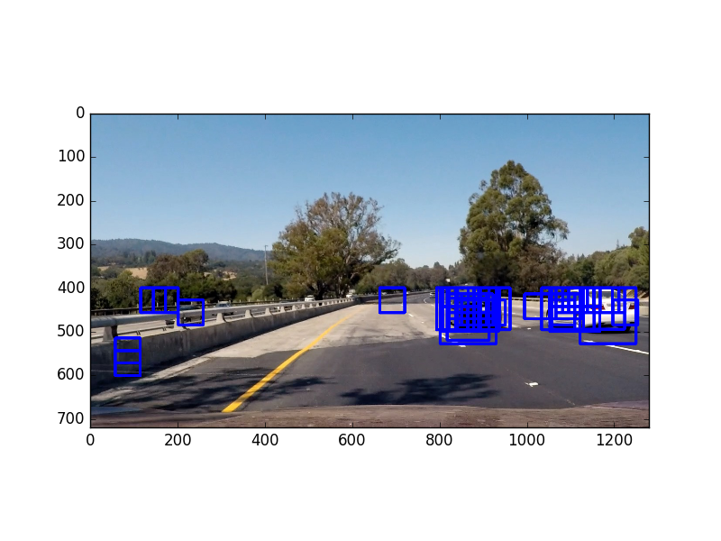
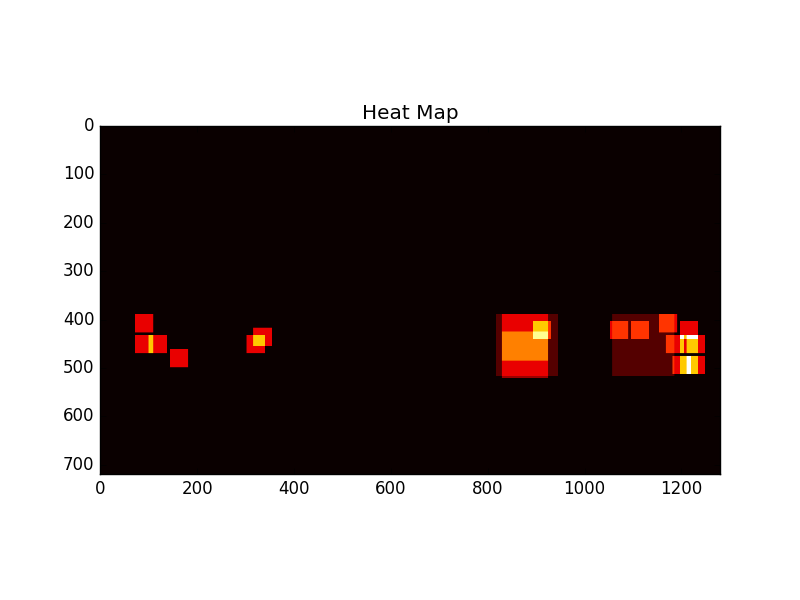
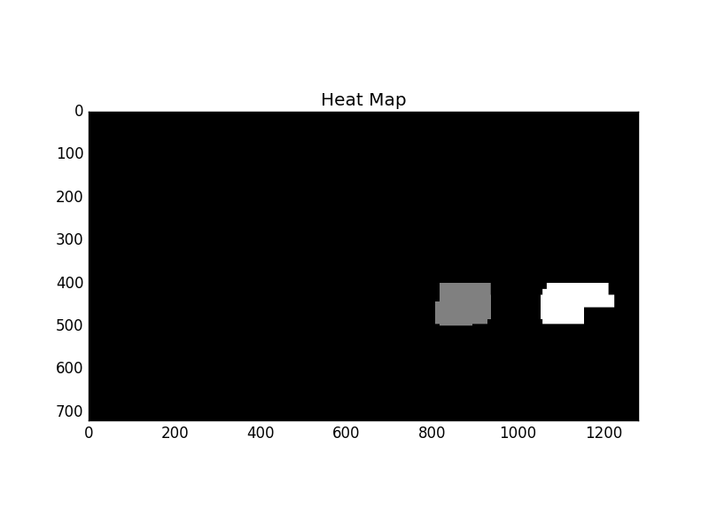
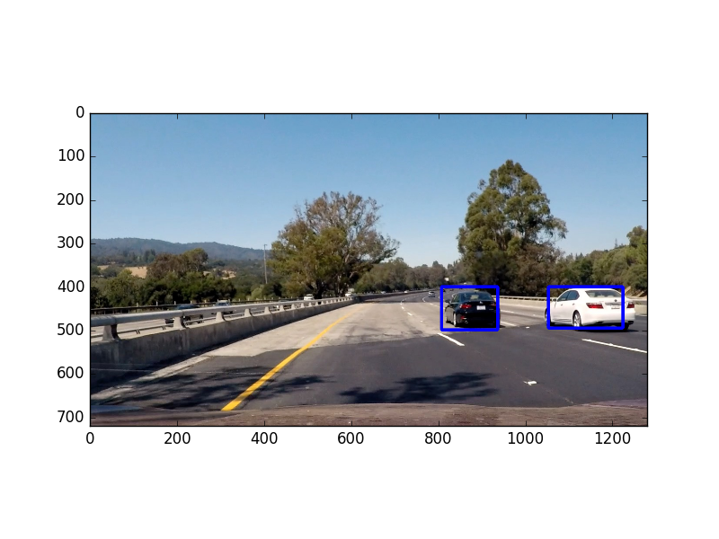

## Vehicle Detection and Tracking

The goals / steps of this project are the following:

* Perform a Histogram of Oriented Gradients (HOG) feature extraction on a labeled training set of images and train a classifier Linear SVM classifier
* Optionally, you can also apply a color transform and append binned color features, as well as histograms of color, to your HOG feature vector.
* Note: for those first two steps don't forget to normalize your features and randomize a selection for training and testing.
* Implement a sliding-window technique and use your trained classifier to search for vehicles in images.
* Run your pipeline on a video stream (start with the test_video.mp4 and later implement on full project_video.mp4) and create a heat map of recurring detections frame by frame to reject outliers and follow detected vehicles.
* Estimate a bounding box for vehicles detected.

[//]: # (Image References)

---
###Writeup

####1. Provide a Writeup / README that includes all the rubric points and how you addressed each one. 

You're reading it!

###Histogram of Oriented Gradients (HOG)

####1. Explain how (and identify where in your code) you extracted HOG features from the training images. Explain how you settled on your final choice of HOG parameters.

All the code to train my model is contained within `vehicle_detection_model.py` The function `train_model` is where the magic happens.
First I read in the training and testing images separately (you'll see why later on) using two glob calls. I then extract the features from each image in `extract_features`.  

For HOG, I use the following parameters:  
* orientations = 9
* pixels_per_cell = 8
* cell_per_block = 2

I found these parameters to be pretty good - my accuracy was above 90% right from the start. During my experimentation, changing the color space had the most profound impact. I started with HLS but eventually settled on using HSV which bumped the accuracy to 94%.  

Also, I added spacial binning and histograms of color to produce even more feature vectors.  

To allow faster experimentation, I cached these features instead of pre-computing them every run.  

####2. Describe how (and identify where in your code) you trained a classifier using your selected HOG features (and color features if you used them).  

With this feature set, I trained a linear SVM. You can see this logic in `vehidle_detection_model.py#train_model`.  
At first, I was using sklearn's train_test_split to split up my training and testing data which produced 99% accuracy. However, when I used the model in my sliding window search, I got many false positives. After reading through some forum posts, I realized that doing a random split was causing my model to overfit since the video was taken in sequence - many of my test images were very similar to training images. To remedy this, I split up the training and test data manually to make sure that the images differed enough. Ultimately, this led to a model with 98% accuracy that performed well in the pipeline.

###Sliding Window Search

####1. Describe how (and identify where in your code) you implemented a sliding window search. How did you decide what scales to search and how much to overlap windows?

The code for this lives in `vehicle_detector.py#find_cars`  

This is where I spent a majority of my time. My algorithm computes all the features over a portion of the image (we dont need to look for vehicles in the sky). Then we use a sliding window to generate 64x64 px images and feed them into the classifier. If the classifier determines this window is a car, we save the image's boundaries.  

I repeated this process after scaling the image 3 times - .9, 1.5, and 2. Based on lots of experimentation, I found this was able to accurately draw the bounding box in most circumstances.

####2. Show some examples of test images to demonstrate how your pipeline is working. What did you do to optimize the performance of your classifier?  

Here's an example of an image with all the positive windows drawn.  

HOG feature extraction is an expensive operation. To make my algorithm more efficient, I computed the HOG features over the entire image and then moved my window throughout this feature list, eliminating the need to compute HOG for each window position. You can see this in vehicle_detecor.py lines 43-49

###Video Implementation

####1. Provide a link to your final video output. Your pipeline should perform reasonably well on the entire project video (somewhat wobbly or unstable bounding boxes are ok as long as you are identifying the vehicles most of the time with minimal false positives.). 

Here's the <a href = "output_video.mp4">final video</a>

####2. Describe how (and identify where in your code) you implemented some kind of filter for false positives and some method for combining overlapping bounding boxes.

After I found the bounding boxes for each scale, I built a heatmap to determine the locations that were most commonly marked.  

Example:  

As you can see, there's a good amount of noise from false positives. Next, I applied a threshold to remove the noise and used `scipy.ndimage.measurements.label()` to group the heatmap locations into distinct sections.  

Example:  

This produced the final result as seen here.  

To make my pipeline more robust, I averaged these heatmaps over the last 20 frames. This eliminated more false positives and missed detections. You can see this logic in `image_processor.py#draw_vehicle_boxes`

###Discussion

####1. Briefly discuss any problems / issues you faced in your implementation of this project. Where will your pipeline likely fail? What could you do to make it more robust?

My first issue was with training my model. I was getting high accuracy scores, but poor results when I plugged it into my image pipeline. The remedy was to make sure that my training and test data was distinct and did not contain similar images.  

Next, I faced problems when tuning hyperparameters for the sliding window approach. Often I would tune the parameters to work with a one test image, but it would fail for another. I had to do lots of experimentation to make it work for most situations.  

My algorithm is far from perfect. First, it doesn't always accurately draw the box around the cars and may only detect a portion of the car. It'll likely fail when there's many cars on the road as it tends to group nearby cars together as one car.  

Last, but most importantly, my algorithm is slow. It takes about 1 minute of processing for 1 second of video... yikes.

To make my algorithm more robust I can do a couple things. To improve both performance and accuracy, I can eliminate the number of times that I need to search the entire image and instead look at the car locations in the previous frame and do my sliding window around that. I'd only do a full search at regular intervals like every 5th frame. I would also like to experiment with using a convolutional neural network to see if I can get better accuracy and performance with image classification.