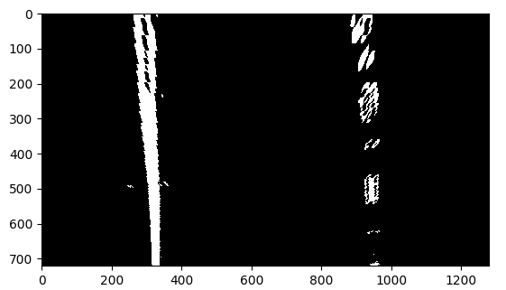

## Advanced Lane Finding

The goals / steps of this project are the following:

* Compute the camera calibration matrix and distortion coefficients given a set of chessboard images.
* Apply a distortion correction to raw images.
* Use color transforms, gradients, etc., to create a thresholded binary image.
* Apply a perspective transform to rectify binary image ("birds-eye view").
* Detect lane pixels and fit to find the lane boundary.
* Determine the curvature of the lane and vehicle position with respect to center.
* Warp the detected lane boundaries back onto the original image.
* Output visual display of the lane boundaries and numerical estimation of lane curvature and vehicle position.

[//]: # (Image References)

[distort_after]: ./output_images/calibration_example.jpg "Undistorted"
[image2]: ./test_images/test1.jpg "Road Transformed"
[image3]: ./examples/binary_combo_example.jpg "Binary Example"
[image4]: ./examples/warped_straight_lines.jpg "Warp Example"
[image5]: ./examples/color_fit_lines.jpg "Fit Visual"
[image6]: ./examples/example_output.jpg "Output"
[video1]: ./project_video.mp4 "Video"

## [Rubric](https://review.udacity.com/#!/rubrics/571/view) Points
###Here I will consider the rubric points individually and describe how I addressed each point in my implementation.  

---
###Writeup / README

####1. Provide a Writeup / README that includes all the rubric points and how you addressed each one.  You can submit your writeup as markdown or pdf.  [Here](https://github.com/udacity/CarND-Advanced-Lane-Lines/blob/master/writeup_template.md) is a template writeup for this project you can use as a guide and a starting point.  

You're reading it!
###Camera Calibration

####1. Briefly state how you computed the camera matrix and distortion coefficients. Provide an example of a distortion corrected calibration image.

The code for this step is contained in `camera_calibrator.py.`

I start by preparing "object points", which will be the (x, y, z) coordinates of the chessboard corners in the world. Here I am assuming the chessboard is fixed on the (x, y) plane at z=0, such that the object points are the same for each calibration image.  Thus, `objp` is just a replicated array of coordinates, and `objpoints` will be appended with a copy of it every time I successfully detect all chessboard corners in a test image.  `imgpoints` will be appended with the (x, y) pixel position of each of the corners in the image plane with each successful chessboard detection.  

I then used the output `objpoints` and `imgpoints` to compute the camera calibration and distortion coefficients using the `cv2.calibrateCamera()` function.  I applied this distortion correction to the test image using the `cv2.undistort()` function and obtained this result:  

<table>
<tr><td>Original Image:</td> <td>Undistorted</td></tr>
<tr>
    <td></td> 
    <td></td>
</tr>
</table>

###Pipeline (single images)

####1. Provide an example of a distortion-corrected image.
After I calculated the camera calibration and distortion coefficients, I constructed an ImageProcessor (image_processor.py) object with these coefficients. This object will be used to do all the heavy lifting during for image processing.

First, each image is undistored using the coefficients and `cv2.undistort()`. Here's an example of one:  

####2. Describe how (and identify where in your code) you used color transforms, gradients or other methods to create a thresholded binary image.  Provide an example of a binary image result.

I next apply color transforms and gradients to the image to create a thresholded binary image in `image_processor.__transform_to_binary()`. For the gradients, I just x-oriented sobel. I found other variants to not produce great results. Next I transform the image to the HLS colorspace and compute thresholds for the lightness and saturation channels. I then combine these 3 thresholds with this formula: `(gradx | (lightness & saturation))`

####3. Describe how (and identify where in your code) you performed a perspective transform and provide an example of a transformed image.

I feed the binary image into `__warp_image()` This function first creates 2 matrices for the src and destination points. It then calls `cv2.getPerspectiveTransform()` to get the transform matrix and then applies the transform to the binary image using `cv2.warpPerspective()` 

####4. Describe how (and identify where in your code) you identified lane-line pixels and fit their positions with a polynomial?

Next, it's time to find the lane lines and fit a polynomial to them. The magic happens in 'lane_search.py'

For the first image in the video, I performed a full search (`full_search()`) which looks at a histogram of all the points in the binary image. We assume that the maximums in each half of the image mark the locations of the lane lines. We then work our way up from the bottom of the image and create bounding boxes around to mark which points are part of the lane lines. I used 40 windows to increase the accuracy. After the image has been completely searched, I have two lists of points that represent the points that belong to each lane line. I then create an `ImageData` object to hold this data. 

In the ImageData, I create a 2nd order polynomial that fits a line to the points in each side.

For subsequent frames, I look at the data from the last frame and use this data to inform where we should start searching in the current frame. This eliminates the need to do the sliding window approach.

####5. Describe how (and identify where in your code) you calculated the radius of curvature of the lane and the position of the vehicle with respect to center.

In `image_data.py` I calculate the radius of curvature in `getCurveRadius()`. I create a 2nd degree polynomial after scaling the pixels to meters. To get the radius of curviture, I use the forumla <a href="http://www.intmath.com/applications-differentiation/8-radius-curvature.php">described here</a>

####6. Provide an example image of your result plotted back down onto the road such that the lane area is identified clearly.

I implemented this step in `__draw_lane_box` in `image_processor.py` My forumla averages the last 10 frames to make the lane finding smoother.

---

###Pipeline (video)

####1. Provide a link to your final video output.  Your pipeline should perform reasonably well on the entire project video (wobbly lines are ok but no catastrophic failures that would cause the car to drive off the road!).

Here's a [link to my video result](./output_video.mp4)

---

###Discussion

####1. Briefly discuss any problems / issues you faced in your implementation of this project.  Where will your pipeline likely fail?  What could you do to make it more robust?

I faced several problems when working through this project. First, I had to do lots of experimentation to figure out the best combination of color spaces and gradients that would best mark the lane lines in various situations. After I figured this out, I had to make sure that my image warping left the lane lines parallel. Again, this took some experimentation. Last, I had to read through some of the sample code to fully understand how the polynomials were computed and how they were used to mark the lane lines. 

One of the biggest issues with my algorithm is that it's slow. It takes ~8 minutes to process a 1 minute file. This definitely wouldn't work in a real-time environment. I could speed it up skipping a couple frames between calculations and re-implementing my solution using C++.

Next, I think my solution will be sensitive to shadows as the lightness and saturation is heavily used when creating the binary image. In addition, my solution doesn't have a great way of recovering if the lane lines are lost in previous frames. 
